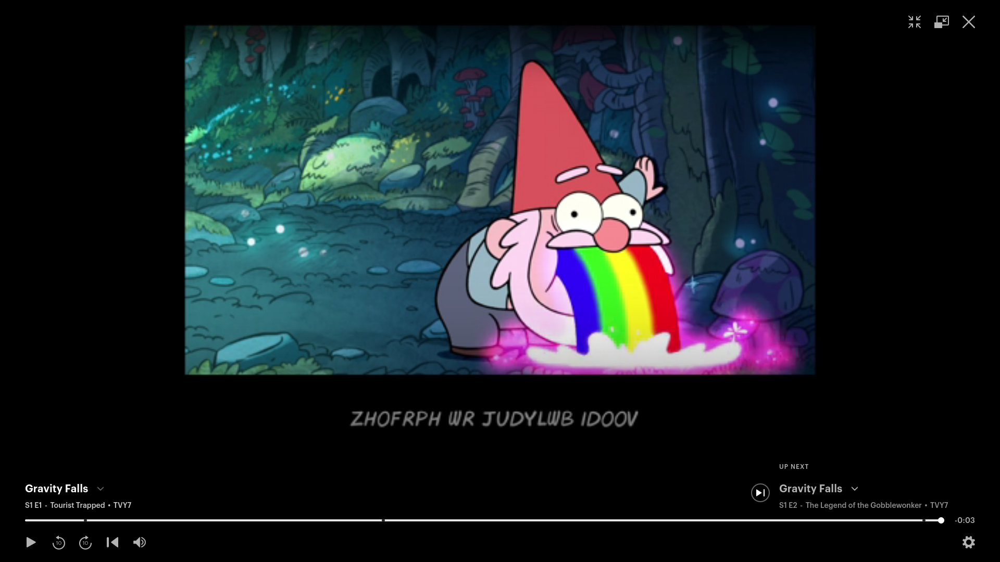
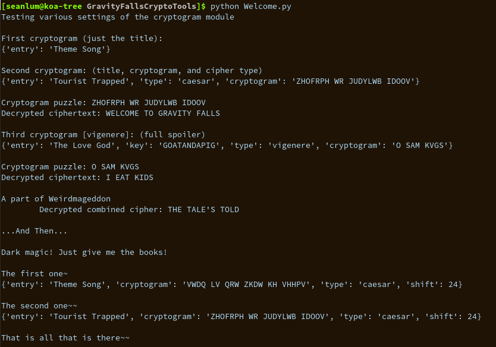
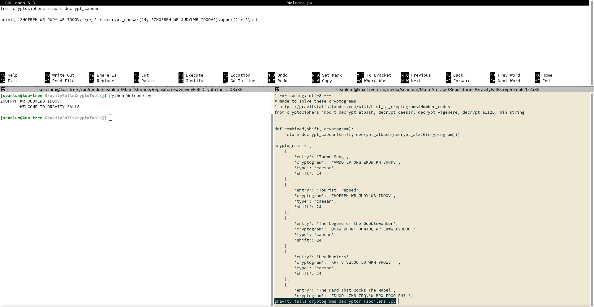

# GravityFallsCryptoTools
Python data tool for Gravity Falls Cryptograms

## [Welcome.py | PoC and Scratchboard](Welcome.py)
Tests the ciphers and their encrypt / decrypt capabilities

## [cryptograms.py](cryptograms.py)
The dwelling place of all the Gravity Falls cryptograms which could be typed up in UTF-8.

Cryptograms not included: Bill's Symbols, Author's Symbols, Combined Symbol Ciphers (maybe a todo?)

**puzzle solver alert**
There are shift values, cipher keys, and various forms of solving data in cryptograms.py
If you just want to use the spoiler levels, you can also retreive the cryptogram names, 
from the gravityfalls.fandom.com/wiki link below:

Cryptograms came from: https://gravityfalls.fandom.com/wiki/List_of_cryptograms#Number_codes

## [cryptociphers.py](cryptociphers.py)

```
Available tools:
	Combined:
		decrypt_combined - is a combination: decrypt_caesar + decrypt_atbash + decrypt_a1z26

	Alphabet:
		shift_alphabet   - Tool which slides alphabets by an offset, useful for caesar ciphers
	
	atbash:
		encrypt_atbash   - Encrypt plaintext using an atbash cipher
		decrypt_atbash   - Decrypt atbash cryptograms using an atbash cipher

	caesar:
		encrypt_caesar   - Encrypt plaintext using a caesar cipher, shift must be supplied, or all possibilities are returned
		decrypt_caesar   - Decrypt plaintext using a caesar cipher, shift must be supplied, or all possibilities are returned

	vigenere:
		encrypt_vigenere - Encrypt plaintex using a vigenere cipher, and supplied key
		decrypt_vigenere - Decrypt to plaintext using a vigenere cipher, and supplied key

	a1z26:
		encrypt_a1z26    - Encrypt plaintext using an a1z26 cipher
		decrypt_a1z26    - Decrypt to plaintext using an a1z26 cipher

	binary:
		bin_string       - Turn binary strings into text
		string_bin	 - Turn text strings into binary strings
```

# Example





